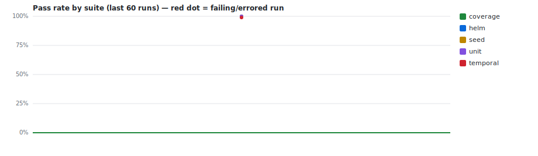

# CI test trends — `ozmartins/project-template-main`

> Auto-generated by **PR Validation** (`publish-test-history`). Do not edit by hand — every
> run regenerates this branch. The machine-readable source of truth is [`runs.jsonl`](./runs.jsonl).
> Deployed-environment E2E trends live separately on the [`e2e-history`](../../tree/e2e-history) branch.

**Last updated:** 2026-06-24 20:07Z · 6 records · suites: `coverage`, `helm`, `seed`, `unit`, `temporal`



## Suites

| Suite | Latest | When (UTC) | Pass 24h | Pass 7d | Green streak | Runs |
|---|---|---|--:|--:|--:|--:|
| `coverage` | ✅ `passed` [↗](https://github.com/ozmartins/project-template-main/actions/runs/29544669173) | — | — | — | 2 | 2 |
| `helm` | ✅ `passed` [↗](https://github.com/ozmartins/project-template-main/actions/runs/28126290566) | — | — | — | 1 | 1 |
| `seed` | ✅ `passed` [↗](https://github.com/ozmartins/project-template-main/actions/runs/28126290566) | — | — | — | 1 | 1 |
| `unit` | ✅ `passed` [↗](https://github.com/ozmartins/project-template-main/actions/runs/28126290566) | 2026-06-24 20:06Z | 100% (1) | 100% (1) | 1 | 1 |
| `temporal` | ❌ `failed` [↗](https://github.com/ozmartins/project-template-main/actions/runs/28126290566) | 2026-06-24 20:07Z | 0% (1) | 0% (1) | 0 | 1 |


## Recent runs

| When (UTC) | Suite | Result | Pass | Fail | Skip | Duration | Commit | Run |
|---|---|---|--:|--:|--:|--:|---|---|
| 2026-06-24 20:07Z | `temporal` | ❌ failed | 279 | 3 | 10 | 32.4s | `68b3186` | [#1](https://github.com/ozmartins/project-template-main/actions/runs/28126290566) |
| 2026-06-24 20:06Z | `unit` | ✅ passed | 77 | 0 | 0 | 4.6s | `68b3186` | [#1](https://github.com/ozmartins/project-template-main/actions/runs/28126290566) |
| — | `coverage` | ✅ passed | 0 | 0 | 0 | — | `4f47a92` | [#47](https://github.com/ozmartins/project-template-main/actions/runs/29544669173) |
| — | `seed` | ✅ passed | 1 | 0 | 0 | — | `68b3186` | [#1](https://github.com/ozmartins/project-template-main/actions/runs/28126290566) |
| — | `helm` | ✅ passed | 362 | 0 | 0 | — | `68b3186` | [#1](https://github.com/ozmartins/project-template-main/actions/runs/28126290566) |
| — | `coverage` | ✅ passed | 0 | 0 | 0 | — | `68b3186` | [#1](https://github.com/ozmartins/project-template-main/actions/runs/28126290566) |


## Unstable tests (recent window)

| Test | Suite | Fails | Flakies | Last |
|---|---|--:|--:|---|
| Azure API version fallback contract in production call sites uses 2025-03-01-preview fallback in llm_agent when AZURE_OPENAI_API_VERSION is unset | `temporal` | 1 | 0 | ❌ |
| Azure API version fallback contract in production call sites keeps llm_agent and probe-llm fallback versions aligned | `temporal` | 1 | 0 | ❌ |
| lint-ontology script passes current migrations and seed | `temporal` | 1 | 0 | ❌ |


---

### Reading this data programmatically

```bash
# every line is one suite-run; newest last
git show ci-history:runs.jsonl | tail -n 20

# e.g. the unit suite's pass-rate over its last 50 runs
git show ci-history:runs.jsonl \
  | jq -rs '[.[] | select(.suite=="unit")] | .[-50:]
            | (map(select(.outcome=="passed")) | length) / length * 100'
```

Record shape: `{ ts, suite, outcome, pass_rate, stats:{expected,unexpected,flaky,skipped,total,duration_ms}, run_url, sha_short, branch, trigger, tests:[{title,file,status,duration_ms}] }`
